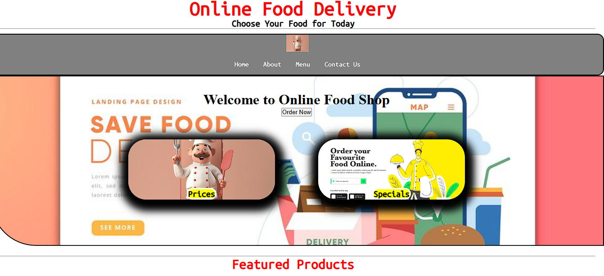

# 🍔 Online Food Delivery System (HTML & CSS)

Mini project ini merupakan simulasi website **Online Food Delivery** yang dibuat menggunakan **HTML dan CSS**.  
Project ini bertujuan untuk melatih dan memperkuat fundamental frontend sebagai langkah awal menuju karir sebagai **Frontend Developer**.

---

## 📌 Preview



---

## 🚀 Features

- 🏠 Landing page (Homepage)
- 📋 Navigation bar (Home, About, Menu, Contact)
- 🍽️ Featured food section
- 🎯 Call-to-action button (Order Now)
- 📩 Contact form page
- 📱 Responsive design (basic media queries)
- 🎨 Styling dengan CSS (Flexbox & Grid)

---

## 🛠️ Tech Stack

- **HTML5**
- **CSS3**
- Google Fonts (Ubuntu Mono)

---

## 📂 Project Structure

```bash
online-food-delivery/
│
├── index.html # Halaman utama
├── contact.html # Halaman contact form
├── styles.css # Styling website
└── README.md
```

---

## 📖 How to Run

1. Clone repository ini:
   ```bash
   git clone https://github.com/achraflyy48/Online-Food-Delivery-System-Using-HTML-and-CSS.git

2. Masuk Ke folder Project :
  ```bash
   cd online-food-delivery
  ```
3. Buka file index.html di browser:
   <ul>
     <li>Double click, atau</li>
     <li>Klik kanan → Open with browser</li>
   </ul>
